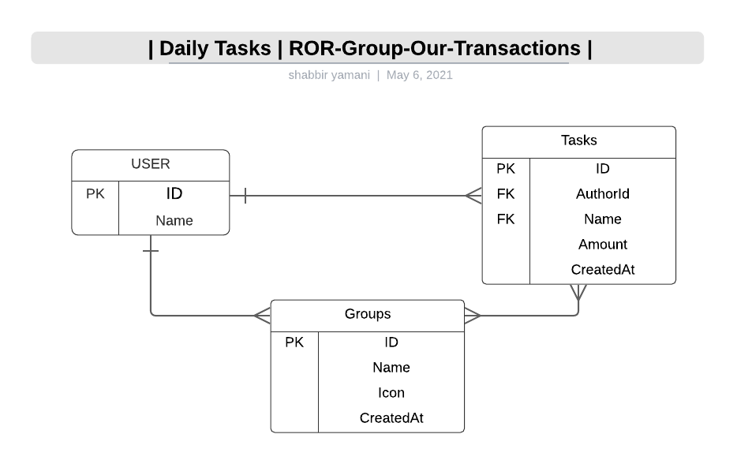

# Project : GROUP OUR TRANSACTIONS
> The project allows an Agile Product Owner to document his day to day activity with a few clicks instead of going through lengthy workflow applications. 
Extra Feature: Duration & A monthly report provides a categorised timespent in each category everyday.
## Scaffold for social media app with Ruby on Rails
> The CAPSTONE in Ruby on Rails is the highlighted project of the RoR module. Implementation of a project where transactions are grouped and listed in grouped and ungrouped lists, ordered most recent first.
New GROUPS can be create by users to add more categorization to their daily activity. 
#### Highlight: Users->List, Users->Invites Friends, Users->Gets Invited By Friends, 



### Built With

- Ruby, Ruby on Rails, VS Code Editor
- Active Records
- Devise Gem
- Forms & Helpers
- Rspec, Capybara, Selenium
- Browser: Chrome {change/override in this File, Last Line: ``` spec\rails_helper.rb ```}
### Getting Started
#### Model generated:
- User Authentication
  - Signup
  - Signin
- All My Transactions
  - View Transactions Recorded by me
    - Add New with Group
    - Add New Ungrouped
  - Duration of each grouped / ungrouped activity
- Manage Groups
  - Add New Groups
- Timeline
  - Transactions ordered Recent First
  - Transactions from Groups
- Monthly Activity Report
### Setup
* To clone this repository, open your Terminal and execute the following command:
``` git clone https://github.com/smy5152/ror-capstone-group-our-transactions.git ```
### Run
* Change into the folder
``` cd ror-capstone-group-our-transactions ```
* Install js dependencies
``` yarn install ```
* Install gems
``` bundle install ```
* Run Database migrations
``` rails db:create ```
``` rails db:migrate ```
* Rails Local Server
``` rails server ``` 
* Launch Local App
- Open your browser and type http://localhost:3000
### How to run the test suite
#### Run tests
``` rpsec --format documentation  ```
#### USER: CREATE, TRANSACTIONS: ADD/Group, ADD/Ungrouped, Create New GROUP


#### BROWSER TEST: With Capybara/Selenium

### How To:
* Run Rails console
``` rails console ```
## Authors
🧑‍💻 **Shabbir**
- GitHub: [@smy5152](https://github.com/smy5152)
- Twitter: [@smy5152](https://twitter.com/smy5152)
- LinkedIn: [Shabbir Yamani](https://www.linkedin.com/in/shabbirmyamani/)
## 🤝 Contributing
Contributions, issues, and feature requests are welcome!
## Show your support
Give a ⭐️ if you like this project!
## Acknowledgments
- [Micoverse team](https://www.microverse.org/)
## 📝 License
This project is [MIT](LICENSE) licensed.
