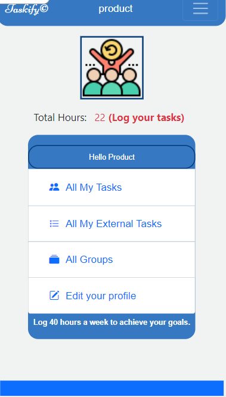
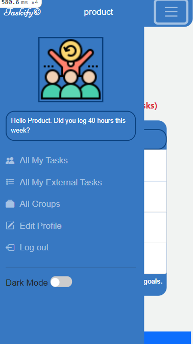
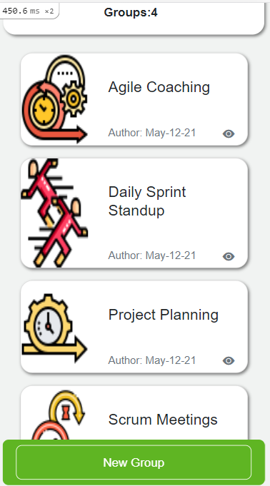
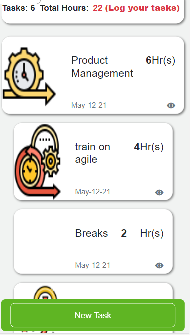

## PROJECT: GROUP Agile PO Activities
> The project allows an Agile Product Owner to document his daily activity with a few clicks instead of going through lengthy workflow applications. 
### Introduction
> The CAPSTONE in Ruby on Rails is the highlighted project of the RoR module. Implementation of a project where transactions are listed as grouped or ungrouped and ordered most recent first.
New GROUPS can be create by users to add more categorization to their daily activity. 
#### Highlight: Users->List, Users->Invites Friends, Users->Gets Invited By Friends, 





### Built With
- Ruby, Ruby on Rails, VS Code Editor
- Active Records
- Cloudinary for img uploads
- Forms & Helpers
- Rspec, Capybara, Selenium
- Browser: Chrome {change/override in this File, Last Line: ``` spec\rails_helper.rb ```}
### Getting Started
#### Model generated:
- User Authentication
  - Signup
  - Signin
- All My Transactions
  - View Transactions Recorded by me
    - Add New with Group
    - Add New Ungrouped
  - Duration of each grouped / ungrouped activity
- Manage Groups
  - Add New Groups
- Timeline
  - Transactions ordered Recent First
  - Transactions from Groups
- Monthly Activity Report
### Setup
* To clone this repository, open your Terminal and execute the following command:
``` git clone https://github.com/smy5152/ror-capstone-group-our-transactions.git ```
### Run
* Change into the folder
``` cd ror-capstone-group-our-transactions ```
* Install js dependencies
``` yarn install ```
* Install gems
``` bundle install ```
* Run Database migrations
``` rails db:create ```
``` rails db:migrate ```
* Rails Local Server
``` rails server ``` 
* Launch Local App
- Open your browser and type http://localhost:3000
* Launch Live App
- [Taskify](https://mytaskify.herokuapp.com/)
### How to run the test suite
#### Run tests
* Change into the folder
``` cd ror-capstone-group-our-transactions ```
* Run the command
``` rpsec --format documentation  ```
#### USER: CREATE, TRANSACTIONS: ADD/Group, ADD/Ungrouped, Create New GROUP
#### BROWSER TEST: With Capybara/Selenium
### How To Test:
* Run Rails console
``` rails console ```
## Authors
🧑‍💻 **Shabbir**
- GitHub: [@smy5152](https://github.com/smy5152)
- Twitter: [@smy5152](https://twitter.com/smy5152)
- LinkedIn: [Shabbir Yamani](https://www.linkedin.com/in/shabbirmyamani/)
## 🤝 Contributing
Contributions, issues, and feature requests are welcome!
## Show your support
Give a ⭐️ if you like this project!
## Acknowledgments
- [Micoverse team](https://www.microverse.org/)
- The design of the project was inspired by [GregoireVella](https://www.behance.net/gregoirevella)
- Slide Out from Left inspired by [Skelly](https://www.codeply.com/p/wJFoHhhkjB)
- Nav Bar theme & template code from [Bootstrap](https://getbootstrap.com/docs/4.1/components/navbar/)
- Robot User Profile Dummy Avatar [PikPng](https://www.pikpng.com/pngvi/xiihwh_robot-user-profile-dummy-avatar-person-ai-svg-png-icon-transparent-ai/)
- Icons made by [Flaticon](https://www.flaticon.com/authors/eucalyp)
## 📝 License
This project is [MIT](LICENSE) licensed.
